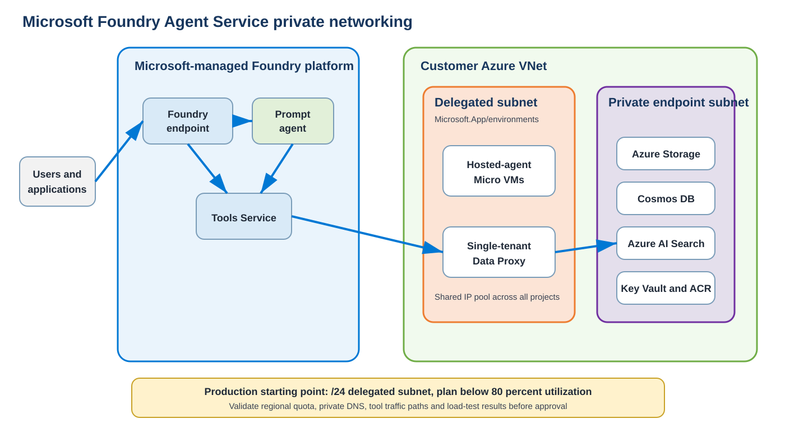

# Microsoft Foundry Agent Service Pre-Sales Architecture

This learning module shows how an Azure pre-sales architect converts incomplete customer information into a defensible private Microsoft Foundry Agent Service design.

The scenario uses **Contoso Retail Bank**, a fictional regulated client. All volumes, regions and constraints are learning assumptions. They must not be reused as customer facts.

## What this module teaches

- How to run demand, networking, security and operations discovery
- How prompt agents and hosted agents affect capacity differently
- How to size the delegated subnet from peak hosted-agent sessions
- How to document confirmed, measured, estimated and assumed inputs
- How to design private endpoints, DNS and controlled outbound traffic
- How to protect a proposal through dependencies, exclusions and acceptance gates

## Scenario summary

| Input | Working value | Classification |
|---|---:|---|
| Eligible employees | 12,000 | Assumed |
| Peak active employees | 2,400 | Estimated |
| Production projects | 3 | Assumed |
| Hosted-agent share | 30% | Design assumption |
| Expected hosted sessions | 150 | Estimated |
| Production delegated subnet | `/24` | Design decision |
| Target utilization | 80% maximum | Design guardrail |

Expected usable-address requirement:

```text
(150 hosted sessions + 20 platform/project addresses) / 0.80 = 213 addresses
```

A `/24` supplies approximately 251 usable addresses. The subnet passes the expected scenario, subject to regional quota validation and load testing.

## Repository contents

```text
foundry-agent-presales/
├── README.md
├── calculators/subnet_sizing.py
├── data/
│   ├── assumptions.csv
│   ├── discovery-questions.csv
│   ├── raid-register.csv
│   └── sizing-scenarios.csv
├── diagrams/foundry-private-networking.svg
└── docs/pre-sales-playbook.md
```

## Architecture



## Working artifacts

- [Google Docs solution playbook](https://docs.google.com/document/d/1E1CUbZp8JPm7WhDgC0BIql2C8N5Gmxfmy_y5LLwn5Ko/edit)
- [Google Sheets sizing and discovery model](https://docs.google.com/spreadsheets/d/1BSiZOsirfu83llHNlZzz2hUbRP8dcuXpDhvC23z3sGc/edit)
- [Google Slides client solutioning deck](https://docs.google.com/presentation/d/1Z1UtG7ljDOymOwHColKrdQlFR7WOfStpQWiojF4JFuk/edit)

Access to these files depends on the owner's Google Drive sharing settings.

## Recommended learning sequence

1. Read the [pre-sales playbook](docs/pre-sales-playbook.md).
2. Complete the [discovery questionnaire](data/discovery-questions.csv) with a fictional or real scenario.
3. Replace the inputs in [sizing scenarios](data/sizing-scenarios.csv).
4. Run the calculator:

   ```bash
   python calculators/subnet_sizing.py --sessions 150 --platform-ips 20 --target-utilization 0.80
   ```

5. Review DNS, tool paths, regional quotas and the RAID register before making a recommendation.
6. Treat load testing as the production capacity gate.

## Important design rule

Treat the Foundry delegated subnet as shared compute capacity. All projects in a Foundry account draw from the same subnet. A larger subnet does not increase the subscription and regional Foundry session quota.

## Disclaimer

This repository is a training example. Validate current Microsoft documentation, feature support, quotas and regional availability before using the pattern in a proposal or production design.
